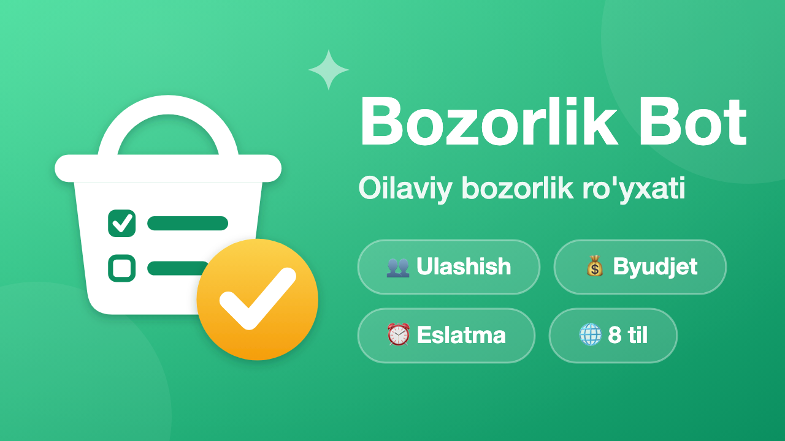

<p align="center">
  
</p>

# 🛒 Tez Bozorlik Bot

<p align="center">
  <a href="https://t.me/tez_bozorlik_bot" target="_blank">
    
  </a>
  <a href="https://render.com" target="_blank">
    
  </a>
  
  
  
  
  <a href="LICENSE">
    
  </a>
</p>

<p align="center">
  <a href="https://t.me/tez_bozorlik_bot" target="_blank">
    
  </a>
</p>

Bozorlik (xarid) ro'yxatini oila va jamoa bo'lib real vaqtda birgalikda yuritish uchun qulay va aqlli Telegram bot.

---

## ✨ Imkoniyatlar

- 🛒 **Bozorlik ro'yxatini tuzish** — mahsulotni narxi bilan (`Non 5000`) yoki narxsiz qo'shish.
- ⚡ **Aqlli ajratgich (Smart parsing)** — mahsulotlarni yangi qatorda yoki vergul bilan kiritish mumkin (`non, nok 2000, uzum`), o'nlik sonlar (`1,5 kg olma`) buzilmaydi.
- 👥 **Ro'yxatni ulashish** — maxsus havola orqali yaqinlarga yuboriladi, hamma bitta ro'yxatni ko'radi va birgalikda belgilaydi.
- ✅ **Checkbox tizimi** — olingan narsani checkbox tugma bilan bitta bosishda belgilab ketish.
- 💵 **Xarajatlar hisobi** — belgilashda narx kiritish orqali sarflangan jami summani avtomatik hisoblash.
- 🎉 **Avtomatik xabarnoma** — hamma narsa sotib olinganda barcha a'zolarga «Bozorlik tugadi!» xabari va sarflangan summa yuboriladi.
- 📊 **Xaridlar statistikasi** — tugagach kim nima olgani, har bir a'zoning xaridi soni va summasi ko'rinadi.
- ⏰ **Eslatmalar** — belgilangan vaqtda eslatma yuborish (har kim o'z vaqt mintaqasida: Sozlamalar → 🕔 Vaqt mintaqasi).
- 🌐 **8 ta til:** O'zbek (lotin/kirill), Rus, Ingliz, Qozoq, Tojik, Turk, Qirg'iz.

---

## 🧰 Texnologiyalar

| Komponent | Texnologiya |
|---|---|
| Dasturlash tili | Python 3.11.9 |
| Framework | [Aiogram 3.x](https://docs.aiogram.dev/) (Asinxron) |
| Ma'lumotlar bazasi | SQLite (`aiosqlite` bilan asinxron) |
| Server & Deploy | Render (Web Service + Healthcheck HTTP server) |
| Testlash | Python `unittest` (54 ta test) |

---

## 🚀 O'rnatish va Ishga Tushirish

```bash
# 1. Virtual muhit yaratish va kutubxonalarni o'rnatish
python3 -m venv .venv
source .venv/bin/activate
pip install -r requirements.txt

# 2. .env sozlamalarini yaratish
cp .env.example .env
# .env ichiga @BotFather bergan tokenni yozing

# 3. Ishga tushirish
python main.py
```

---

## 💡 Foydalanish

1. **🛒 Yangi ro'yxat** — ro'yxat nomini kiritasiz, so'ng mahsulotlarni yuborasiz (masalan: `non, nok 2000, uzum`).
2. **👥 Ulashish** — taklif havolasini oila a'zolariga yuborasiz, ular ham bitta ro'yxatga ulanadi.
3. **✅ Xarid jarayoni** — bozorda olingan narsani **⬜ tugmasini bosib** belgilaysiz (narx kiritish ixtiyoriy).
4. **🎉 Yakunlash** — barcha mahsulotlar olingach, bot barcha a'zolarga sarflangan jami summani xabar qiladi.

---

## 📁 Loyiha Tuzilishi

```
bozorlik_bot/
├── main.py          # Bot va healthcheck serverni ishga tushirish
├── config.py        # .env sozlamalari
├── states.py        # FSM holatlari
├── database/        # SQLite asinxron modeli va migratsiyalar
├── handlers/        # start, ro'yxatlar, mahsulotlar, xaridlar
├── keyboards/       # reply va inline klaviaturalar
├── locales/         # 8 ta tildagi matnlar to'plami
├── utils/           # aqlli narx/miqdor ajratish va formatlash
├── branding/        # logotiplar, bannerlar va BotFather skriptlari
└── tests/           # 54 ta to'liq unit-testlar
```

---

## 🧪 Testlar

Barcha 54 ta unit-testlarni ishga tushirish:

```bash
python3 -m unittest discover -s tests
```

---

## 📬 Aloqa va Takliflar

Savollar, takliflar yoki xatolar haqida xabar berish uchun:
- Telegram aloqa boti: [@Ibrohim_qobilov_aloqabot](https://t.me/Ibrohim_qobilov_aloqabot)
- Dasturchi profili: [Ibrohim Qobilov](https://github.com/Ibrohim-Qobilov)
